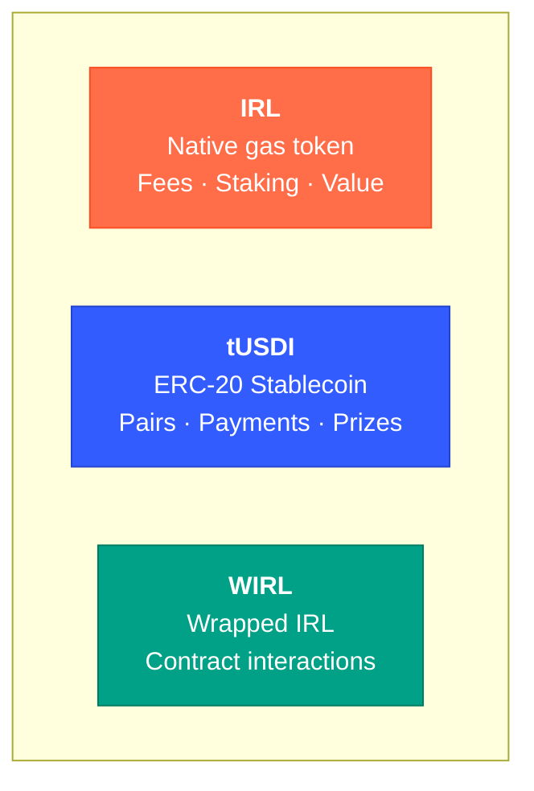
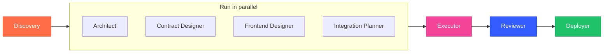

<div align="center">


# Integra Developer Studio

**One conversation. Eight agents. Production-ready dApp.**

A Claude Code plugin that guides you from idea to deployed dApp on the Integra blockchain.

[](https://claude.ai/claude-code)
[]()
[]()

</div>

---

## Quick start

```bash
claude --plugin-dir /path/to/integra-studio
```

```
/integra-studio:start
```

The wizard handles the rest.

---

## How it works


> [!IMPORTANT]
> Every step requires your approval. The studio never proceeds without your go-ahead.

---

## Commands

| Command | Purpose |
|:--------|:--------|
| `/integra-studio:start` | Wizard — shapes your idea, scaffolds the project |
| `/integra-studio:brainstorm` | Explore ideas, no commitment |
| `/integra-studio:research` | Investigate patterns and pitfalls before building |
| `/integra-studio:build` | Build phase-by-phase with approval gates |
| `/integra-studio:review` | 6-check quality audit, graded A-F |
| `/integra-studio:deploy` | Ship to testnet or mainnet |
| `/integra-studio:explore` | Learn about Integra features |
| `/integra-studio:status` | Check project progress |

---

## Tokens

Every dApp supports three tokens. The wizard selects which matter for your use case.



| dApp type | Tokens used | Example |
|:----------|:-----------|:--------|
| DeFi | IRL + tUSDI + WIRL | IRL/tUSDI trading pairs |
| Gaming | IRL + tUSDI | IRL entry fees, tUSDI prize pools |
| NFT | IRL (+ tUSDI optional) | IRL minting, tUSDI fixed-price sales |
| Social | IRL + tUSDI | IRL governance, tUSDI tipping |
| AI Agents | IRL + tUSDI | IRL gas budget, tUSDI trading capital |
| Infrastructure | IRL (+ tUSDI optional) | IRL gas costs, tUSDI API credits |

> [!TIP]
> Testnet faucet at **`testnet.integralayer.com`** gives **10 IRL + 1,000 tUSDI** per request.

<details>
<summary>Token addresses</summary>

| Token | Address |
|:------|:--------|
| tUSDI (testnet) | `0xa640d8b5c9cb3b989881b8e63b0f30179c78a04f` |
| WIRL | `0x5002000000000000000000000000000000000001` |
| USDI (mainnet) | TBD |

</details>

---

## Agents



| Agent | Role |
|:------|:-----|
| **Discovery** | Understands who you are, shapes the idea |
| **Architect** | System design, tech stack, data flow |
| **Contract Designer** | Solidity interfaces and specs |
| **Frontend Designer** | Pages, components, user flows (+ Stitch AI) |
| **Integration Planner** | Ecosystem connections, token selection, XP events |
| **Executor** | Writes all code through 7-skill UI pipeline |
| **Reviewer** | 6 quality checks, A-F grading |
| **Deployer** | Ships to testnet/mainnet, configures subdomain |

---

## Design adaptation

The UI adapts to your dApp category:

| Category | Mood | Why |
|:---------|:-----|:----|
| **DeFi** | Trust · Precision | Users handle money — cool tones, data-dense dashboards |
| **Gaming** | Energy · Excitement | Dopamine-driven — vibrant accents, bold animations |
| **NFT** | Gallery · Premium | Art is the content — neutral surfaces, generous whitespace |
| **Social** | Warm · Community | People-first — coral tones, feed layouts |
| **AI Agents** | Futuristic · Sleek | Control-panel feel — dark surfaces, streaming data |
| **Infrastructure** | Technical · Reliable | Developer-focused — code-friendly, minimal decoration |

---

## Quality review

`/review` runs 6 checks and grades **A through F**:

| Check | What it catches |
|:------|:---------------|
| :lock: **Contract Security** | Reentrancy, access control, input validation |
| :keyboard: **Frontend Quality** | TypeScript strict, error boundaries, React patterns |
| :link: **Integra Compliance** | Web3Auth, XP events, chain IDs, design system |
| :coin: **Token Integration** | Correct addresses, configurable, category-appropriate |
| :art: **UI/UX Quality** | WCAG AA, design-category fit, onboarding, errors |
| :zap: **Performance** | Bundle <200KB, LCP <2.5s, CLS <0.1 |

---

## Best practices

7 guides in `knowledge/best-practices/` — read by every skill during build and review:

| Guide | Covers |
|:------|:-------|
| `ui-ux-design.md` | Layout, components, states, Web3 transaction UX |
| `design-adaptation.md` | Color psychology per category, palette rationale |
| `performance.md` | Next.js, bundle budgets, gas optimization, Core Web Vitals |
| `accessibility.md` | WCAG AA, keyboard nav, ARIA, screen readers |
| `security-frontend.md` | XSS, secrets, transaction safety, Stitch safety |
| `quality-checklist.md` | Master A-F grading checklist |
| `onboarding-ux.md` | First-time UX, zero-balance flows, error mapping |

---

## Tech stack

| Layer | Stack |
|:------|:------|
| Contracts | Solidity 0.8.24+, Hardhat, OpenZeppelin |
| Frontend | Next.js 14+, TypeScript strict, Tailwind, shadcn/ui |
| Auth | Web3Auth (Google, X, Email) |
| Design | [integra-brand](https://github.com/Integra-layer/integra-brand) or custom AI-generated |
| Tokens | IRL + tUSDI + WIRL |
| Deploy | `yourapp.integralayer.com` via Caddy |

---

## Changelog

### V3 — Multi-token, best practices, design intelligence

- **Multi-token ecosystem** — IRL + tUSDI + WIRL supported across all templates, skills, and generated code. Token selection adapts per dApp category.
- **Best practices library** — 7 guides (UI/UX, performance, a11y, security, onboarding, quality checklist, design adaptation) read by every skill.
- **Design adaptation** — Category-specific color psychology and layout guidance. DeFi gets trust-blue dashboards, gaming gets vibrant energy, NFT gets gallery minimalism.
- **Enhanced review** — 6 checks instead of 4. Added token integration, UI/UX quality, and performance. A-F grading.
- **Smarter wizard** — Blueprint includes token rationale and design mood. Config stores `category` and `tokens` for downstream skills.
- **Quality checklist** — Master checklist for build, review, and audits.
- **Onboarding UX** — Zero-balance detection, faucet guidance, Web3 error mapping.

### V2 — Dual network, Stitch AI, branding toggle

- **Dual network** — Mainnet (26217) and testnet (26218). Wizard asks which one.
- **Stitch AI** — Google Stitch generates UI screens. You pick a variant, executor rebuilds in React.
- **Branding toggle** — Official Integra brand or custom AI-generated palette via ui-ux-pro-max.
- **UI skill pipeline** — 7 skills polish every frontend: guidelines, pro-max, taste, shadcn, animation, patterns, react-dev.
- **Selectable wizard** — Technical questions have numbered options instead of open-ended prompts.

### V1 — Foundation

- **Conversational wizard** — Discovery-driven, never template-driven. Every idea emerges from conversation.
- **8 agents** — Discovery, Architect, Contract Designer, Frontend Designer, Integration Planner, Executor, Reviewer, Deployer.
- **Phase-gate model** — 6 build phases, each requiring approval.
- **Integra ecosystem** — Asset Passport, Wrapper, GOB, Agent Arena, XP System, Web3Auth integration.
- **6 category templates** — DeFi, AI Agents, NFT, Social, Gaming, Infrastructure.
- **Security checklist** — ReentrancyGuard, access control, input validation, contract verification.

---

<details>
<summary><strong>Project structure</strong></summary>

```
integra-studio/
|-- CLAUDE.md                     Main instructions
|-- agents/                       8 agent definitions
|-- skills/                       8 commands (start, build, research, brainstorm, explore, review, deploy, status)
|-- knowledge/
|   |-- best-practices/           7 quality & design guides
|   |-- design-systems/           Integra brand + custom template
|   |-- networks/                 Mainnet, testnet, tokens
|   +-- templates/                6 category scaffolds
+-- templates/                    Drop-in config files
```

</details>

<details>
<summary><strong>Environment</strong></summary>

```bash
# Optional — Stitch AI UI generation
STITCH_API_KEY=your_key_here
```

Generated projects get a full `.env.example` with network config, Web3Auth, contract addresses, and token addresses.

</details>

---

<div align="center">

Built for [Integra](https://integralayer.com)

```
/integra-studio:start
```

</div>
