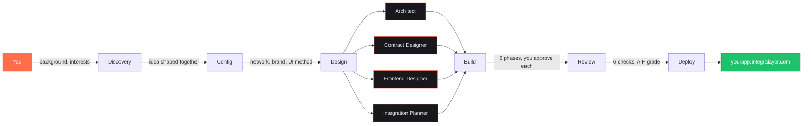
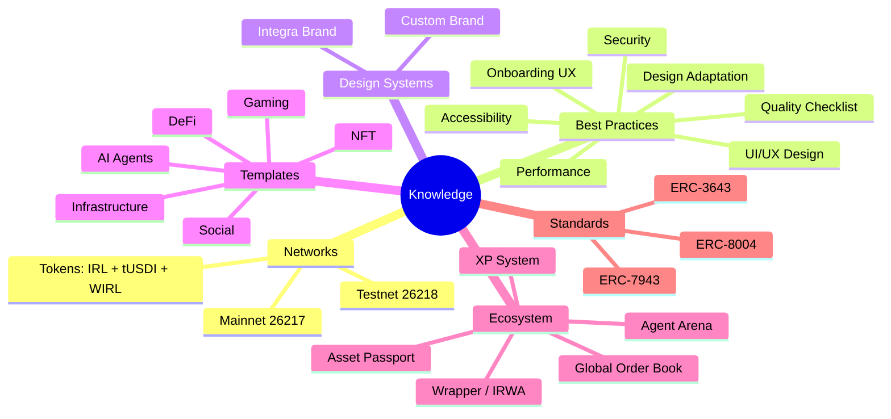
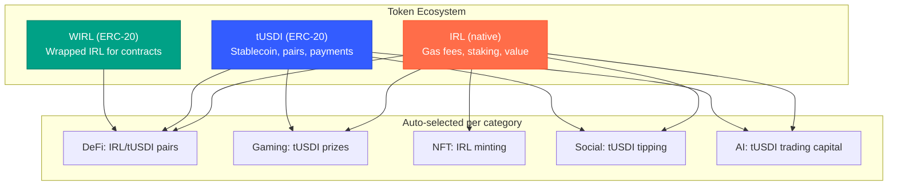

<div align="center">

<br />


<br />

# Integra Developer Studio

**Build anything on Integra. Start from wherever you are.**

A Claude Code plugin that talks to you, understands what you care about,
and helps you design, build, and deploy a dApp on the Integra blockchain.

<br />

[](https://claude.ai/claude-code)
[](https://github.com/Integra-layer/integra-brand)
[]()
[]()

</div>

<br />

## Get started

```bash
claude --plugin-dir /path/to/integra-studio
```

Then:

```
/integra-studio:start
```

That's it. The rest is a conversation.

---

## What's new in V3

### :coin: Multi-token ecosystem

Every dApp now ships with three tokens out of the box:

- **`IRL`** — Native gas token for fees, staking, and value storage
- **`tUSDI`** — ERC-20 stablecoin (`0xa640d8b5c9cb3b989881b8e63b0f30179c78a04f`) for trading pairs, payments, and prize pools
- **`WIRL`** — Wrapped IRL (`0x5002...0001`) for smart contract interactions that need IRL as ERC-20

The wizard auto-selects which tokens matter based on your dApp type. DeFi gets IRL/tUSDI trading pairs. Gaming gets tUSDI prize pools. Social gets tUSDI tipping. All 6 category templates include Solidity snippets and frontend integration patterns.

> [!TIP]
> On testnet, the faucet at `testnet.integralayer.com` distributes **10 IRL + 1,000 tUSDI** per request (24h cooldown). Your dApp auto-detects zero balances and guides users there.

### :books: Best practices library

Seven guides in `knowledge/best-practices/` that every skill reads during build and review:

| Guide | Covers |
|:------|:-------|
| :art: `ui-ux-design.md` | Layout fundamentals, component patterns (cards, forms, modals, tables), loading/error/empty states, Web3 transaction UX |
| :performing_arts: `design-adaptation.md` | Color psychology per dApp category — why DeFi uses cool tones (trust) and gaming uses vibrant accents (excitement). Integra brand adaptation notes per category |
| :zap: `performance.md` | Next.js optimization, bundle budgets (<200KB), gas optimization patterns, Core Web Vitals targets (LCP <2.5s, CLS <0.1) |
| :wheelchair: `accessibility.md` | WCAG AA: 4.5:1 contrast, keyboard navigation, ARIA labels, `prefers-reduced-motion`, semantic HTML |
| :shield: `security-frontend.md` | XSS prevention, secret management, transaction confirmation UX, Stitch AI safety rules, dependency auditing |
| :white_check_mark: `quality-checklist.md` | Master **A-F grading** checklist for contracts, frontend, tokens, accessibility, performance, and docs |
| :wave: `onboarding-ux.md` | First-time user flows, zero-balance detection, progressive disclosure, Web3 error-to-friendly-message mapping |

### :performing_arts: Design adaptation by category

Each dApp category gets design guidance rooted in color psychology:

| Category | Mood | Palette Direction | Why |
|:---------|:-----|:-----------------|:----|
| :bank: **DeFi** | Trust, precision | Cool tones (teal, blue) + gold accents | Users handle money — UI must feel reliable and data-accurate |
| :video_game: **Gaming** | Excitement, energy | Vibrant purple + neon accents | Dopamine-driven, reward-focused, celebratory moments |
| :framed_picture: **NFT** | Gallery, premium | Neutral dark + single bold accent | The art is the content — UI is the frame, not the painting |
| :people_holding_hands: **Social** | Warm, community | Coral/orange + warm tones | Human and inviting, centered around people not data |
| :robot: **AI Agents** | Futuristic, sleek | Dark surfaces + cyan/neon glow | Control-panel feel with "alive" indicators and streaming data |
| :wrench: **Infrastructure** | Technical, reliable | Neutral + code-friendly greens | Documentation-first, minimal decoration, developer-familiar |

> [!NOTE]
> With **Integra branding**, these adaptations apply as subtle variations within the official Coral palette. With **custom branding**, `ui-ux-pro-max` uses this guide to generate a category-appropriate design system.

### :mag: Enhanced `/review`

The review skill now runs **6 checks** instead of 4:

1. :lock: **Contract security** — Reentrancy, access control, input validation, custom errors
2. :keyboard: **Frontend quality** — TypeScript strict, zero `any`, error boundaries, React patterns
3. :link: **Integra compliance** — Web3Auth, XP events, chain IDs, design system
4. :coin: **Token integration** *(new)* — Correct addresses, configurable not hardcoded, category-appropriate selection
5. :art: **UI/UX quality** *(new)* — WCAG AA accessibility, design-category fit, onboarding flow, error UX
6. :zap: **Performance** *(new)* — Bundle size, LCP, CLS, Server Components usage

Reports now include token and UI/UX scoring alongside the existing contract and frontend findings.

### :sparkles: Smarter `/start` wizard

- Blueprint now includes **token selection rationale** — which tokens, why, how they fit the dApp
- Blueprint now includes **design adaptation notes** — which mood, which palette, why
- Project config (`config.json`) stores `category` and `tokens` fields so every downstream skill knows what to build

<details>
<summary><strong>Previous changes (V2)</strong></summary>

- **Dual network** — Mainnet (26217) and testnet (26218) both supported. Wizard asks which one
- **Stitch AI** — Google Stitch generates UI screens from prompts. You pick a style variant, executor rebuilds in React
- **Branding toggle** — Official Integra brand or custom design. Custom uses ui-ux-pro-max to generate a unique palette
- **UI skill pipeline** — 7 skills (guidelines, pro-max, taste, shadcn, animation, patterns, react-dev) polish every frontend
- **Selectable wizard** — Every technical question has 2-4 selectable options. No more open-ended config questions

</details>

---

## How it works



The wizard doesn't pick for you. It listens, asks follow-ups based on who you are, and helps you find an idea that only you would come up with.

---

## Commands

### :rocket: Create

| Command | What it does |
|:--------|:------------|
| `/integra-studio:start` | Interactive wizard — discovers who you are, shapes an idea together, scaffolds the project with personalized docs, selects tokens and design mood |
| `/integra-studio:brainstorm` | Explore dApp ideas with no commitment. Generates concepts based on your background and interests |

### :hammer_and_wrench: Build

| Command | What it does |
|:--------|:------------|
| `/integra-studio:build` | Phase-by-phase builder: contracts :arrow_right: frontend :arrow_right: integration :arrow_right: UI polish :arrow_right: XP :arrow_right: testing. You approve each phase |
| `/integra-studio:research` | Investigate contract patterns, security pitfalls, gas optimization, frontend UX, and token strategies before writing code |

### :package: Ship

| Command | What it does |
|:--------|:------------|
| `/integra-studio:review` | 6-check audit: contract security, frontend quality, Integra compliance, token integration, UI/UX quality, performance. **A-F grading** |
| `/integra-studio:deploy` | Deploy to testnet or mainnet — contracts, frontend, subdomain at `yourapp.integralayer.com` |

### :compass: Explore

| Command | What it does |
|:--------|:------------|
| `/integra-studio:explore` | Interactive tour of Integra features — Asset Passport, GOB, Agent Arena, XP, tokens, and more |
| `/integra-studio:status` | Check project progress — what's built, what's next, what needs attention |

> [!IMPORTANT]
> Every command uses interactive prompts. You approve every decision. Nothing happens without your say.

---

## Architecture

### :busts_in_silhouette: Agents

Eight specialized agents handle different parts of the work:

| Agent | Role |
|:------|:-----|
| :mag: `discovery` | Understands who you are and what you want to build |
| :triangular_ruler: `architect` | Designs the system — files, stack, data flow |
| :scroll: `contract-designer` | Writes Solidity interfaces and contract specs |
| :computer: `frontend-designer` | Designs pages, components, user flows + Stitch AI screens |
| :link: `integration-planner` | Maps connections to the Integra ecosystem + token selection |
| :keyboard: `executor` | Writes the actual code (7-skill UI pipeline) |
| :shield: `reviewer` | Checks security, quality, tokens, accessibility, brand compliance |
| :rocket: `deployer` | Ships to testnet/mainnet and configures subdomain |

> [!TIP]
> Agents run in parallel when possible. After discovery, the architect, contract-designer, frontend-designer, and integration-planner all work simultaneously.

### :brain: Knowledge base



### :paintbrush: UI generation

Two paths, same quality:

**With Stitch AI** (requires `STITCH_API_KEY`):
1. Frontend-designer generates screens via Stitch MCP
2. You pick from 1-3 style variants per key screen
3. Executor rebuilds in Next.js/React using the HTML as visual spec
4. UI skill pipeline polishes every component

**Without Stitch** (manual pipeline):
1. Frontend-designer produces component trees and wireframe descriptions
2. Executor builds from the design document
3. UI skill pipeline polishes every component

Both paths produce the same result — Stitch just gives you visual options to choose from.

### :coin: Token ecosystem

Every generated dApp integrates with the Integra token ecosystem:



> [!WARNING]
> **Dual decimal warning:** IRL uses **18 decimals** on EVM but **6 decimals** on Cosmos SDK. Any code bridging between layers must explicitly convert. See `knowledge/networks/shared.md`.

### :hammer: Tech stack

- :gear: **Contracts** — Solidity 0.8.24+, Hardhat, OpenZeppelin, Ignition deployment
- :globe_with_meridians: **Frontend** — Next.js 14+, TypeScript strict, Tailwind CSS, shadcn/ui
- :key: **Wallet** — Web3Auth (Google, X, Email social login)
- :art: **Design** — [integra-brand](https://github.com/Integra-layer/integra-brand) tokens or custom (ui-ux-pro-max)
- :coin: **Tokens** — IRL + tUSDI + WIRL with per-category selection
- :cloud: **Deployment** — `yourapp.integralayer.com` via Caddy reverse proxy

---

## Project structure

<details>
<summary><strong>Click to expand full tree</strong></summary>

```
integra-studio/
|-- CLAUDE.md                          Main instructions
|-- agents/                            8 agent definitions
|   |-- discovery.md
|   |-- architect.md
|   |-- contract-designer.md
|   |-- frontend-designer.md           + Stitch MCP tools
|   |-- integration-planner.md
|   |-- executor.md                    + 7-skill UI pipeline
|   |-- reviewer.md
|   +-- deployer.md
|-- skills/                            8 commands (each has SKILL.md)
|   |-- start/                         Interactive wizard
|   |-- build/                         Phase-by-phase builder + Stitch pipeline
|   |-- research/                      Pre-build investigation
|   |-- brainstorm/                    Idea exploration
|   |-- explore/                       Ecosystem tour
|   |-- review/                        6-check quality audit
|   |-- deploy/                        Testnet/mainnet deployment
|   +-- status/                        Progress tracking
|-- knowledge/                         Ecosystem reference
|   |-- integra-ecosystem.md
|   |-- design-system.md
|   |-- conventions.md
|   |-- product-ideas.md
|   |-- stitch-integration.md          Stitch MCP setup + pipeline
|   |-- ui-skill-pipeline.md           Lean vs full UI pipeline
|   |-- best-practices/                Quality & design guides
|   |   |-- ui-ux-design.md            Layout, components, states, Web3 UX
|   |   |-- design-adaptation.md       Color/mood per dApp category + rationale
|   |   |-- performance.md             Next.js, bundle, gas, Core Web Vitals
|   |   |-- accessibility.md           WCAG AA, keyboard, ARIA, contrast
|   |   |-- security-frontend.md       XSS, secrets, tx safety, Stitch safety
|   |   |-- quality-checklist.md       Master A-F grading checklist
|   |   +-- onboarding-ux.md           First-time UX, zero-balance, error mapping
|   |-- design-systems/
|   |   |-- integra-brand.md           Official brand tokens
|   |   +-- custom-brand.md            Custom brand template (ui-ux-pro-max)
|   |-- networks/
|   |   |-- mainnet.md                 Chain ID 26217
|   |   |-- testnet.md                 Chain ID 26218
|   |   |-- shared.md                  IRL/airl, WIRL, precompiles
|   |   +-- tokens.md                  Token registry: IRL, tUSDI, WIRL
|   +-- templates/                     Per-category scaffolds (+ token integration)
|       |-- defi-template.md
|       |-- ai-agent-template.md
|       |-- nft-template.md
|       |-- social-template.md
|       |-- gaming-template.md
|       +-- infrastructure-template.md
+-- templates/                         Drop-in config files
    |-- hardhat.config.ts.template
    |-- env.example.template
    |-- web3auth-provider.tsx.template
    +-- tailwind-integra.ts.template
```

</details>

---

## Environment setup

The only optional env var for the studio itself:

```bash
# Google Stitch AI UI Generation (optional -- everything works without it)
# Get your key: https://stitch.withgoogle.com/
STITCH_API_KEY=your_key_here
```

> [!NOTE]
> Generated projects use the full env template at `templates/env.example.template` which includes network config, Web3Auth, contract addresses, token addresses (tUSDI, WIRL), and Stitch.

---

## Principles

- :bulb: **Your idea, not ours.** The studio adapts to your background, your interests, your perspective. It has a conversation, not a menu.
- :raised_hand: **You decide everything.** Every phase has an approval gate. Nothing happens without your say.
- :mortar_board: **Works at any level.** Never written Solidity? Fine. Senior blockchain dev? Also fine. The questions adapt.
- :chains: **Integra-native.** Every project uses the [brand system](https://github.com/Integra-layer/integra-brand) (or your custom design), emits XP events, integrates with the token ecosystem, and deploys to `*.integralayer.com`.
- :gem: **Premium UI.** Seven specialized skills ensure proper layout, typography, component patterns, animations, accessibility, and visual polish.
- :white_check_mark: **Quality by default.** Best practices are baked in, not bolted on. Every build reads the 7-guide library. Every review checks against the master checklist.

---

<div align="center">

<br />

Built for [Integra](https://integralayer.com)

<br />

```
/integra-studio:start
```

<br />

</div>
