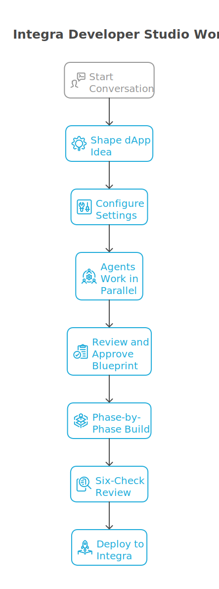
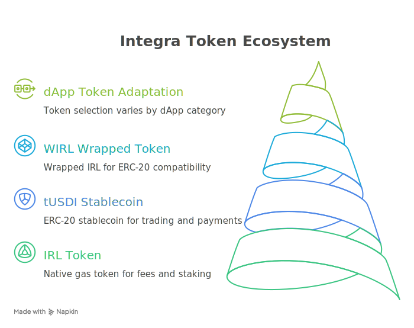
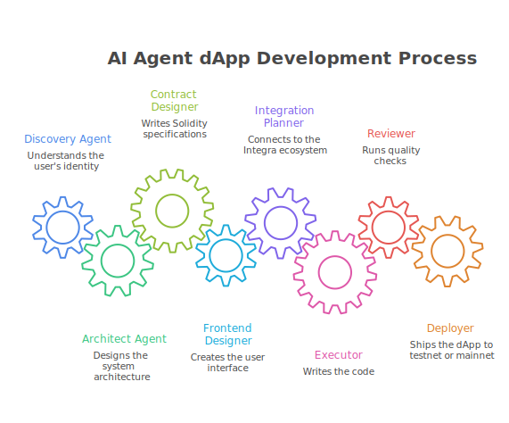
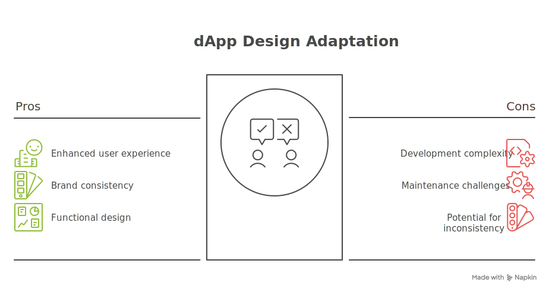
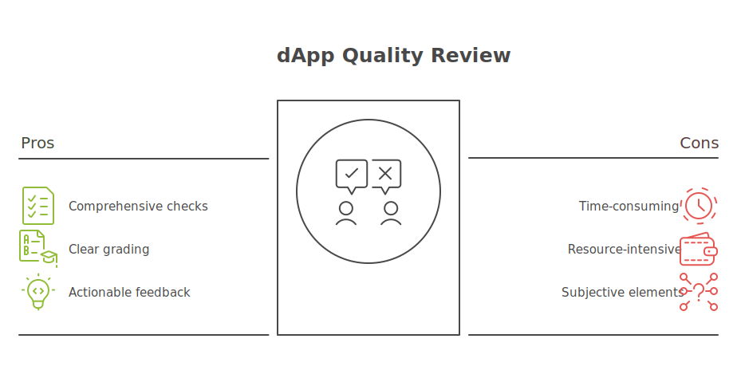

<div align="center">

<br />


<br /><br />

# Integra Developer Studio

### The AI-powered dApp factory for the Integra blockchain.

One conversation. Eight agents. Production-ready code.

<br />

[](https://claude.ai/claude-code)
[]()
[]()
[](https://github.com/Integra-layer/integra-brand)

<br />

**You talk. The studio builds.** Tell it who you are and what you care about.
It designs the architecture, writes the contracts, builds the frontend,
wires up the ecosystem, and deploys — all while you approve every step.

<br />

</div>

---

## :rocket: Quick start

```bash
# Point Claude Code to the plugin
claude --plugin-dir /path/to/integra-studio
```

```
/integra-studio:start
```

That's it. The wizard takes it from there.

> [!TIP]
> Never written Solidity? No problem. The wizard adapts to your experience level — from first-timer to senior blockchain dev.

---

## :eyes: How it works

<div align="center">

</div>

<br />

The studio runs a **conversation-driven pipeline**:

1. **:speech_balloon: Discovery** — The wizard asks about your background, interests, and problems. No menus. No templates. Every idea emerges from your unique perspective.

2. **:gear: Configuration** — You pick your network (mainnet/testnet), branding (Integra official or custom AI-generated), and UI method (Stitch AI or manual).

3. **:busts_in_silhouette: Parallel design** — Four agents work simultaneously: Architect, Contract Designer, Frontend Designer, and Integration Planner. You review the blueprint.

4. **:hammer_and_wrench: Phase-by-phase build** — Six phases, each requiring your approval:

   `Contracts` :arrow_right: `Frontend` :arrow_right: `Integration` :arrow_right: `UI Polish` :arrow_right: `XP System` :arrow_right: `Testing`

5. **:mag: Six-check review** — Security, quality, compliance, tokens, UX, and performance. Graded A-F.

6. **:globe_with_meridians: Deploy** — Contracts verified on-chain, frontend live at `yourapp.integralayer.com`.

> [!IMPORTANT]
> **You decide everything.** Every phase has an approval gate. The studio never proceeds without your explicit go-ahead.

---

## :joystick: Commands

### Start something new

| Command | What it does |
|:--------|:------------|
| **`/integra-studio:start`** | Interactive wizard. Discovers who you are, shapes an idea together, picks tokens and design mood, scaffolds the project with personalized docs. |
| **`/integra-studio:brainstorm`** | Zero-commitment idea exploration. Generates dApp concepts based on your background. |
| **`/integra-studio:research`** | Deep-dive into contract patterns, security pitfalls, gas optimization, and frontend UX *before* you write any code. |

### Build and ship

| Command | What it does |
|:--------|:------------|
| **`/integra-studio:build`** | The main event. Six phases, each with approval gates. Contracts, frontend, integration, UI polish, XP, testing. |
| **`/integra-studio:review`** | Six-check quality audit with A-F grading. Covers security, quality, compliance, tokens, UX, and performance. |
| **`/integra-studio:deploy`** | Ship to testnet or mainnet. Contracts + frontend + subdomain at `yourapp.integralayer.com`. |

### Learn and track

| Command | What it does |
|:--------|:------------|
| **`/integra-studio:explore`** | Interactive tour of Integra features — Asset Passport, GOB, Agent Arena, XP, tokens. |
| **`/integra-studio:status`** | Project dashboard. What's built, what's next, what needs attention. |

---

## :coin: Token ecosystem

<div align="center">

</div>

<br />

Every dApp ships with three tokens. The wizard auto-selects which ones matter based on your dApp type:

| Token | Type | What it's for | Address |
|:------|:-----|:-------------|:--------|
| **`IRL`** | Native | Gas fees, staking, value storage | Native (no contract address) |
| **`tUSDI`** | ERC-20 | Stablecoin — trading pairs, payments, prizes | `0xa640d8b5c9cb3b989881b8e63b0f30179c78a04f` |
| **`WIRL`** | ERC-20 | Wrapped IRL for smart contract interactions | `0x5002000000000000000000000000000000000001` |

**How tokens adapt per category:**

| dApp type | Primary | Secondary | Example use |
|:----------|:--------|:----------|:------------|
| :bank: DeFi | IRL + tUSDI | WIRL | IRL/tUSDI trading pairs, tUSDI lending |
| :video_game: Gaming | IRL | tUSDI | IRL entry fees, tUSDI prize pools |
| :framed_picture: NFT | IRL | tUSDI (optional) | IRL minting fees, tUSDI fixed-price sales |
| :people_holding_hands: Social | IRL | tUSDI | IRL governance staking, tUSDI tipping |
| :robot: AI Agents | IRL | tUSDI | IRL gas budget, tUSDI trading capital |
| :wrench: Infrastructure | IRL | tUSDI (optional) | IRL gas costs, tUSDI API credits |

> [!TIP]
> On testnet, the faucet at **`testnet.integralayer.com`** distributes **10 IRL + 1,000 tUSDI** per request (24h cooldown). Your dApp auto-detects zero balances and guides users there.

> [!WARNING]
> **Dual decimal warning:** IRL uses **18 decimals** on EVM but **6 decimals** on Cosmos SDK. Any code bridging between layers must explicitly convert. The studio handles this automatically.

---

## :busts_in_silhouette: Eight agents, one team

<div align="center">

</div>

<br />

| Agent | What it does | Model |
|:------|:------------|:------|
| :mag: **Discovery** | Understands who you are, shapes the idea with you | Sonnet |
| :triangular_ruler: **Architect** | Designs system structure, tech stack, data flow | Opus |
| :scroll: **Contract Designer** | Writes Solidity interfaces and specs | Sonnet |
| :computer: **Frontend Designer** | Designs pages, components, user flows (+ Stitch AI) | Sonnet |
| :link: **Integration Planner** | Maps ecosystem connections, selects tokens, plans XP events | Haiku |
| :keyboard: **Executor** | Writes all the code through a 7-skill UI pipeline | Sonnet |
| :shield: **Reviewer** | Runs 6 quality checks, grades A-F | Opus |
| :rocket: **Deployer** | Ships to testnet/mainnet, configures subdomain | Sonnet |

> [!NOTE]
> Agents run **in parallel** when possible. After discovery, the Architect, Contract Designer, Frontend Designer, and Integration Planner all work simultaneously — cutting design time significantly.

---

## :performing_arts: Design adaptation

<div align="center">

</div>

<br />

The studio doesn't just build — it **designs with intent**. Each dApp category gets a visual identity rooted in color psychology:

| Category | Mood | Palette | Why it works |
|:---------|:-----|:--------|:-------------|
| :bank: **DeFi** | Trust, precision | Cool teal/blue + gold accents | Users handle money. The UI must feel reliable and data-accurate. |
| :video_game: **Gaming** | Excitement, energy | Vibrant purple + neon accents | Dopamine-driven design. Reward moments should feel celebratory. |
| :framed_picture: **NFT** | Gallery, premium | Neutral dark + bold accent | The art is the content. The UI is the frame, not the painting. |
| :people_holding_hands: **Social** | Warm, community | Coral/orange tones | Human and inviting. Centered around people, not data. |
| :robot: **AI Agents** | Futuristic, sleek | Dark + cyan/neon glow | Control-panel feel. Agents should feel "alive" with streaming data. |
| :wrench: **Infrastructure** | Technical, reliable | Neutral + green accents | Documentation-first. Developers want speed, not decoration. |

> [!NOTE]
> With **Integra branding**, these are subtle variations within the official Coral palette. With **custom branding**, the `ui-ux-pro-max` skill generates a full design system tailored to your category.

---

## :white_check_mark: Quality review

<div align="center">

</div>

<br />

The `/review` command runs **six checks** and grades your dApp **A through F**:

| # | Check | What it catches |
|:--|:------|:---------------|
| :lock: | **Contract security** | Reentrancy, access control, input validation, unchecked returns |
| :keyboard: | **Frontend quality** | TypeScript strict, zero `any`, error boundaries, React patterns |
| :link: | **Integra compliance** | Web3Auth config, XP events, chain IDs, design system adherence |
| :coin: | **Token integration** | Correct addresses, configurable (not hardcoded), category-appropriate selection |
| :art: | **UI/UX quality** | WCAG AA accessibility, design-category fit, onboarding flow, error UX |
| :zap: | **Performance** | Bundle <200KB, LCP <2.5s, CLS <0.1, Server Components usage |

---

## :books: Best practices library

Seven comprehensive guides that every skill reads during build and review:

| Guide | What it covers |
|:------|:--------------|
| :art: **UI/UX Design** | Layout fundamentals, component patterns, loading/error/empty states, Web3 transaction UX |
| :performing_arts: **Design Adaptation** | Color psychology per category, Integra brand adaptations, palette rationale |
| :zap: **Performance** | Next.js optimization, bundle budgets, gas patterns, Core Web Vitals targets |
| :wheelchair: **Accessibility** | WCAG AA: contrast ratios, keyboard nav, ARIA, screen readers, reduced motion |
| :shield: **Security** | XSS prevention, secret management, transaction confirmation, Stitch safety |
| :white_check_mark: **Quality Checklist** | Master A-F grading across contracts, frontend, tokens, a11y, performance, docs |
| :wave: **Onboarding UX** | First-time flows, zero-balance detection, progressive disclosure, error mapping |

> [!TIP]
> These guides apply to **both new projects and existing ones**. Run `/review` on any Integra dApp to audit it against the full checklist.

---

## :paintbrush: UI generation

Two paths, same premium quality:

<table>
<tr>
<td width="50%">

**:sparkles: With Stitch AI**
<sub>Requires <code>STITCH_API_KEY</code></sub>

1. Frontend Designer generates screens via Stitch MCP
2. You pick from 1-3 style variants
3. Executor rebuilds in Next.js/React
4. 7-skill UI pipeline polishes everything

</td>
<td width="50%">

**:hammer: Manual pipeline**
<sub>No setup needed</sub>

1. Frontend Designer produces component trees
2. Executor builds from the design document
3. 7-skill UI pipeline polishes everything

</td>
</tr>
</table>

**The 7-skill pipeline** (runs on every frontend):

`web-design-guidelines` :arrow_right: `frontend-patterns` :arrow_right: `react-dev` :arrow_right: `shadcn-ui` :arrow_right: `ui-animation` :arrow_right: `taste-skill` :arrow_right: `ui-ux-pro-max`*

<sub>*ui-ux-pro-max only runs for custom branding</sub>

---

## :hammer: Tech stack

Every generated dApp follows Integra conventions:

| Layer | Stack |
|:------|:------|
| :gear: **Contracts** | Solidity 0.8.24+, Hardhat, OpenZeppelin, Ignition deployment |
| :globe_with_meridians: **Frontend** | Next.js 14+, TypeScript strict, Tailwind CSS, shadcn/ui |
| :key: **Auth** | Web3Auth — Google, X, Email social login (no MetaMask required) |
| :art: **Design** | [integra-brand](https://github.com/Integra-layer/integra-brand) or custom via ui-ux-pro-max |
| :coin: **Tokens** | IRL + tUSDI + WIRL with per-category selection |
| :cloud: **Deploy** | `yourapp.integralayer.com` via Caddy reverse proxy |

---

## :file_folder: Project structure

<details>
<summary><strong>Click to expand full tree</strong></summary>

```
integra-studio/
|-- CLAUDE.md                          Main instructions
|-- agents/                            8 agent definitions
|   |-- discovery.md
|   |-- architect.md
|   |-- contract-designer.md
|   |-- frontend-designer.md           + Stitch MCP tools
|   |-- integration-planner.md
|   |-- executor.md                    + 7-skill UI pipeline
|   |-- reviewer.md
|   +-- deployer.md
|-- skills/                            8 commands
|   |-- start/                         Interactive wizard
|   |-- build/                         Phase-by-phase builder
|   |-- research/                      Pre-build investigation
|   |-- brainstorm/                    Idea exploration
|   |-- explore/                       Ecosystem tour
|   |-- review/                        6-check quality audit
|   |-- deploy/                        Testnet/mainnet deployment
|   +-- status/                        Progress tracking
|-- knowledge/
|   |-- best-practices/                7 quality & design guides
|   |-- design-systems/                Integra brand + custom template
|   |-- networks/                      Mainnet, testnet, tokens
|   +-- templates/                     6 category scaffolds
+-- docs/
    +-- visuals/                       Napkin AI-generated diagrams
```

</details>

---

## :wrench: Environment

The only optional env var for the studio itself:

```bash
# Google Stitch AI (optional — everything works without it)
STITCH_API_KEY=your_key_here
```

> [!NOTE]
> Generated projects get a full `.env.example` with network config, Web3Auth, contract addresses, token addresses (tUSDI, WIRL), and Stitch.

---

## :star2: Principles

| | Principle | What it means |
|:-|:----------|:-------------|
| :bulb: | **Your idea, not ours** | The studio adapts to your background and interests. It has a conversation, not a menu. Two people will never get the same dApp. |
| :raised_hand: | **You decide everything** | Every phase has an approval gate. Nothing ships without your explicit go-ahead. |
| :mortar_board: | **Works at any level** | Never written Solidity? The wizard guides you. Senior dev? It stays out of your way. |
| :chains: | **Integra-native** | Every project uses the brand system, emits XP events, integrates with the token ecosystem, deploys to `*.integralayer.com`. |
| :gem: | **Premium UI by default** | Seven specialized skills ensure proper layout, typography, animations, accessibility, and visual polish. |
| :white_check_mark: | **Quality baked in** | Best practices aren't bolted on — they're read during every build and enforced during every review. A-F grading keeps the bar high. |

---

<div align="center">

<br />

Built for [Integra](https://integralayer.com) :orange_heart:

<br />

```
/integra-studio:start
```

**Your next dApp is one conversation away.**

<br />

</div>
